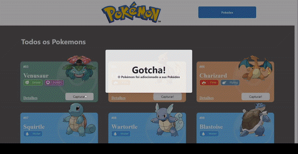
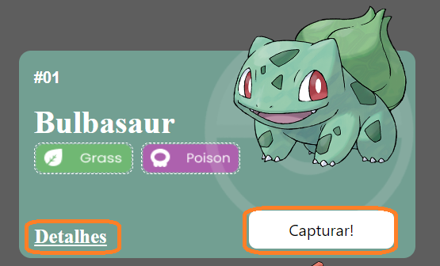
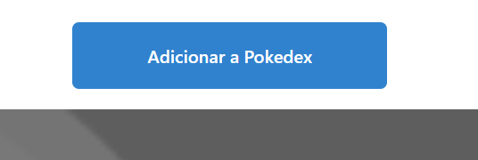
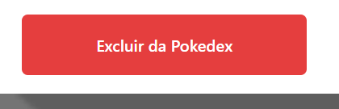
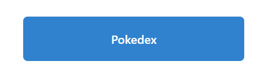

# **Projeto React e API's**
O Projeto React e APIs é um site de pokémons que possui três páginas: Home, Pokedex
 e Detalhes. Sendo possível adicionar á pokedex e remove-los. 

<a id="ancora"></a>
#  <b> Menu </b>  
- [O Projeto](#oprojeto)
- [Estrutura do Projeto](#estrutura)
- [Funcionalidades](#funcionalidade)
- [Requisitos](#requisitos)
- [Agradecimentos](#agradecimentos)


<a id="oprojeto"></a>
# O Projeto  
### Deploy : https://projeto-react-apis-mu.vercel.app/
 

#### O Projeto tem como objetivo implementar conteúdos apresentados  durante o Bootcamp da Labenu ,seguindo um  [design](https://www.figma.com/file/KseyA2Ofghiek2Cy3ZaDre/Poked%C3%A9x?t=AEi3zEmWmarf1FbP-0 "design") proposto e  consumindo API  .Tecnlogias utilizadas :
 - ```React```;
 - ```Axios```;
 - ```Chakra UI```;
 - ```Styled-components```;
 - ```React-router-dom```;
 - ```React useContext```;
 - ```React useState,useEffect```;
 - ```Hooks e Custom hooks```;
 - ```React-icons```;
 - ```Components```

#
<a id="estrutura"></a>
## Estrutura do Projeto 


#### Arquivo ```src``` 
Contém todos as pastas e arquivos do projeto!
#
#### Pasta ```assets``` 
Contém todas as imagens dos types dos pokemons e outras usadas  neste projeto.
#
#### Pasta ```Components```
Contém:
 - ```CardPokemon``` ->  renderiza informações e botões para pokemon. 
 - ```Footer``` ->  roda pé da página onde terá nome, link para redes sociais do autor.
 - ```Header``` -> cada página terá uma interface específica.
 - ```Modal``` ->  é ativado quando adiciona ou remove pokemon da pokedex. 
 - ```ProgressBar``` -> barra  para habilidades.  
#
#### Pasta  ```Contants```
Contém a Url padrão da API utilizada.
#
#### Pasta  ```GlobalContext```
Contém arquivo GlobalState onde será armazenado todos os estados e funções importantes, para serem passados como context(props).
#
#### Pasta ```GlobalState``` 
Arquivo responsável por exportar todos as funções , estados  do projeto. passando como ```context``` (props) estes arquivos, onde poderá ser usado em qualquer componente.
#
#### Pasta ```hooks```
Arquivo contém um ```CustomHook``` da retorna todas as informações do pokemon. Que pode ser exportado para qualquer componente.
#
#### Pasta ```Pages```
Contém: 
 - ```DetailsPage``` -> detalhes do pokemon selecionado.
 - ```ErrorPage``` -> se o caminho da página estiver errado,  terá um header para retornar a página Home
 - ```HomePage``` -> Página inicial, onde haverá a lista de pokemons para interagir.
 - ```PokedexPage``` - Página onde terá os pokemons adicionados. 
#
#### Pasta ```routes```
Contém :
 - ```coordinator``` -> retorna funções (buttons) para navegação entre as páginas . Utilizando parâmetros para seu destino.
 - ```Router```-> Componente que armazena o controle das páginas , identificando cada uma com um valor que é passado para ```coordinator``` e será  utilizado  no ```App.js```
#
#### Pasta ```utils ```
Contém :
- ``` returnColors``` -> Função que retorna as cores de cada tipo do pokemon  para seu Card.
- ``` returnTypes``` ->Função que retorna os ícones de cada pokemon em seu Card.
>  [Topo](#ancora)

<a id="funcionalidade"></a>
 ## Funcionalidade 
## 
 ## ```CardPokemon``` 
 - O botão ```detalhes``` Direciona para página onde será possível ver todos dados  e adicionar e/ou remover o pokemon da pokedex. 
 - O botão ```Capturar``` Captura o pokemon selecionado e o envia para pokedex.
  ## ```Details``` 
 
 

 Estes botões estão no header quando a página for details.
 ## ```Botão para ver  outros Pokemons```
 
  - O botão **Próxima Lista** renderiza uma nova lista com 10 novos pokemons.
  - O botão **Voltar Lista** renderiza a lista anterior.  
 ## ``` Botão Pokedex ```
 
 - Botão leva a página pokedex onde terá os pokemons adiconados.
  # 
>  [Topo](#ancora)

<a id="requisitos"></a>

## **Requisitos**
Este projeto terá como fonte de dados para a sua criação a [Poke Api](https://pokeapi.co/ "Poke Api"), uma Api pública, muito usada para aplicações focadas em aprendizado de programação e também usada em cases de processos seletivos.

Os conteúdos principais  a serem estudados são:

- Integração de APIs
- React Router
- Design Systems
- Estado Global

## **Enunciado**
É objetivo deste projeto criar um site com três páginas usando a Poke Api com as seguintes ferramentas:

- React
- React Router
- Styled-components
- React Context
- Axios

## Requisitos
-  **Gerais:**
	- [✔️] O site deve ter 3 páginas: Home, Pokedex e Detalhes;
	- [✔️] Projeto deve seguir o [design](https://www.figma.com/file/KseyA2Ofghiek2Cy3ZaDre/Poked%C3%A9x?t=AEi3zEmWmarf1FbP-0 "design") proposto;
	- [✔️] O fluxo de trocas de páginas devem ser semelhante ao [fluxograma](https://www.figma.com/proto/KseyA2Ofghiek2Cy3ZaDre/Poked%C3%A9x?page-id=0%3A1&node-id=2%3A2&viewport=358%2C197%2C0.27&scaling=scale-down&starting-point-node-id=2%3A2 "fluxograma");
- **Página Home:**
	- [✔️]  Mostrar uma lista de Pokemons, contendo ao menos 20 Pokemons;
	- [✔️] Cada Pokemon será representado por um Card;
	- [✔️] Em cada card de Pokemon tem um botão para adicioná-lo à Pokedex e um outro botão para acessar os detalhes do Pokemon;
	- [✔️] Header dessa página terá um botão para acessar a página da Pokedex
- **Página Pokédex**
	- [✔️] Renderizar a lista de pokémons adicionados na pokedex;
	- [✔️] Em cada card de Pokemon deve ter um botão para removê-lo da Pokedex e um outro botão para acessar os detalhes do Pokemon.
	- [✔️] Header deve ter um botão para voltar para a Home
	- [✔️] Não deve ser possível adicionar o mesmo Pokemon duas vezes na Pokedex
- **Página de Detalhes**
	- [✔️] Mostrar os detalhes do Pokemon selecionado, com informações descritas
	- [✔️] Header deve ter um botão para adicionar ou remover da Pokedex e outro para voltar a página home.
	
>  [Topo](#ancora)


#
<a id="agradecimentos"></a>
# Agradecimentos 
Este projeto é importante para meu aprendizado, nele pude por em pratica os conteúdos desenvolvidos. Aprender sobre a API e sua estrutura a PokeApi é desafiador nesse ínicio de aprendizado. Mas consegui desenvolver o projeto com o apoio dos instrutores e amigos de classe, que de forma geral todos nos ajudamos. 
Agradeço a **Labenu** pela atenção com todos nós, e pelo modelo de ensino que nos traz bons ensinamentos.
Agradeço  aos **instrutores e monitores** que desempenham um papel importante nesta jornada e a todos colegas de turma.  

>  [Topo](#ancora)
#
